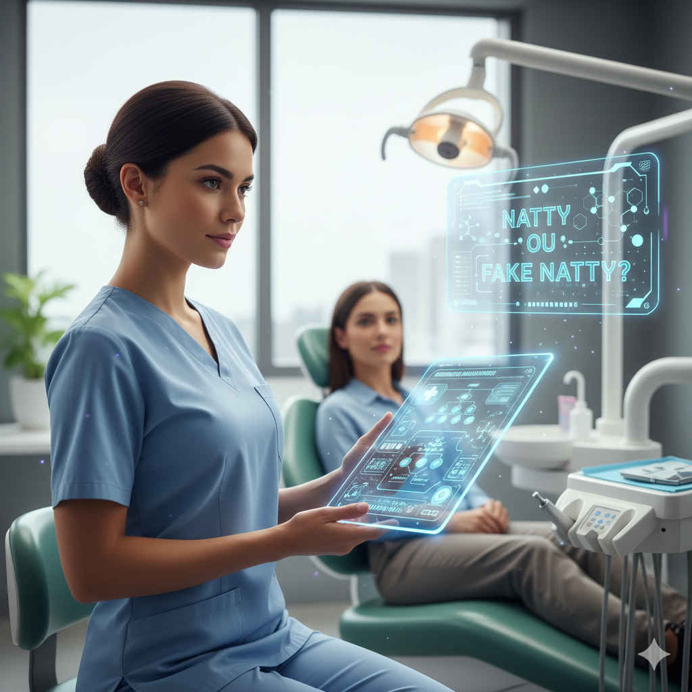

# 🦷 Natural ou Fake Natty? — Assistente IA para Interações Medicamentosas na Odontologia

## 📘 Descrição do Projeto

Este projeto foi desenvolvido como parte do Lab "**Natural ou Fake Natty?**" da DIO, explorando o uso de IAs Generativas para criar conteúdos realistas, úteis e aplicáveis ao dia a dia profissional.

Aqui, construí um assistente virtual inteligente, voltado para apoiar dentistas na identificação de possíveis interações medicamentosas, tornando o atendimento mais **seguro**, **rápido** e **embasado**.

O projeto reúne texto, imagem e áudio, todos gerados ou aprimorados com Inteligência Artificial.

---

## 🤖 Tecnologias Utilizadas

* **ChatGPT** – geração e refinamento do texto técnico
* **Ferramenta de geração de imagem (IA)** – criação de ilustração para o projeto
* **ElevenLabs** – geração de áudio com voz feminina, técnica e firme
* **HTML + CSS** – construção da página visual do projeto
* **GitHub** – versionamento e documentação

---

## 🧪 Objetivo do Projeto

Explorar o potencial das IAs Generativas criando conteúdos “natty” (naturais) e realistas, integrando:

* ✔️ Texto
* ✔️ Imagem
* ✔️ Áudio
* ✔️ Página web
* ✔️ Documentação profissional

Tudo isso para fortalecer o portfólio e demonstrar domínio de tecnologias emergentes.

---

## 🧠 Processo de Criação

* **Escolha do Tema:** Interações medicamentosas para dentistas — área essencial, complexa e pouco explorada por IA.
* **Geração do Texto Técnico:** Criado com IA, ajustado para clareza, precisão e linguagem profissional.
* **Criação da Arte:** Imagem produzida usando modelo generativo, simulando consulta odontológica moderna.
* **Produção do Áudio:** Geração de narração com voz feminina, firme e técnica, tornando o conteúdo acessível e imersivo.
* **Construção da Página:** Estruturação de uma landing page simples e elegante utilizando **HTML + CSS**.
* **Publicação do Projeto:** Arquivos organizados e submetidos ao **GitHub**, com documentação clara e visual.

---

## 🎧 Áudio Explicativo

Para ouvir a narração do projeto:

👉 [Clique aqui para ouvir o áudio](audio-projeto.mp3)

---

## 🖼️ Imagem Gerada com IA

A imagem ilustrativa do projeto foi criada com modelo generativo e representa o uso de IA aplicada à prática odontológica.

---

## 🚀 Resultado Final

Este projeto demonstra na prática:

* Criação de conteúdo multimídia com **IA**
* Integração de **texto + imagem + áudio**
* Uso de técnicas modernas de documentação
* Capacidade técnica + criatividade
* Domínio de ferramentas de **IA generativa**
* Construção de um artefato real para portfólio

É um exemplo direto de como a IA pode ajudar profissionais da saúde, especialmente dentistas, a trabalhar com mais **segurança** e **precisão**.

---

## 💬 Reflexão

Criar algo “natty” com IA é desafiador porque exige que o conteúdo pareça humano, natural e crível.
O processo deixa claro que a IA não substitui o profissional, mas amplia sua capacidade, **acelera pesquisas** e **melhora a tomada de decisão**, especialmente em áreas técnicas como Odontologia, ajudando na tomada de decisão e promovendo segurança clínica, muito importante no dia a dia dos profissionais de saúde. 
